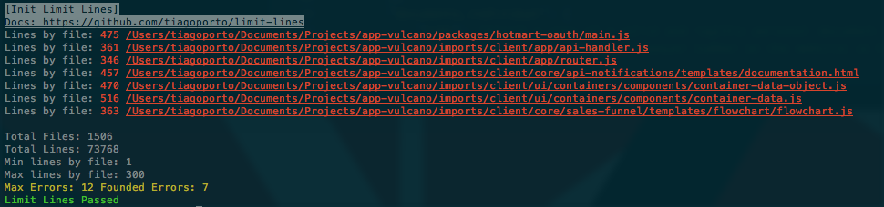

<p align="center">
  
<p>

 

<p align="right">
  <code> 👍 ? <a href="https://github.com/tiagoporto/limit-lines/stargazers">⭐</a> : <a href="https://github.com/tiagoporto/limit-lines/issues">😞</a></code>
</p>

[](https://github.com/tiagoporto/limit-lines/releases)
[](https://www.npmjs.com/package/limit-lines)
[](https://www.npmjs.com/package/limit-lines)
[](https://packagephobia.now.sh/result?p=limit-lines)

<!-- [](https://coveralls.io/github/tiagoporto/limit-lines) -->
<!-- [](https://stryker-mutator.github.io) -->

> Lint and report number of lines by file.



## Installation

```bash
npm install limit-lines
```

## Execute

```bash
limitlines [options]
```

## Options

### Path

`string`, separate by comma.

accept [globby](https://github.com/sindresorhus/globby) paths.

Default: `.`

```bash
limitlines --path 'folder1/**/*, folder2/*.{html,js}'
```

### Ignore

`string`, separate by comma

Paths to ignore.

Default: `node_modules`

```bash
limitlines --ignore 'somefolder'
```

### Max Lines

`integer`

Maximum lines by file. Default: `300`

```bash
limitlines --maxlines 450
```

### Min Lines

`integer`

Minimun accepted lines by file. Default: 1

```bash
limitlines --minlines 1
```

### Max Errors

`integer`

Maximum errors accept. Default: `0`

```bash
limitlines --maxerrors 3
```

### Version

Output version number

Alias `-v`

```bash
limitlines --version
```

## License

This project is licensed under the [MIT license](https://github.com/tiagoporto/limit-lines/blob/main/LICENSE).
